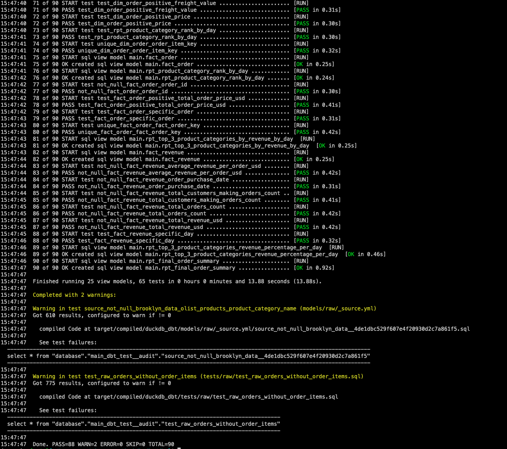
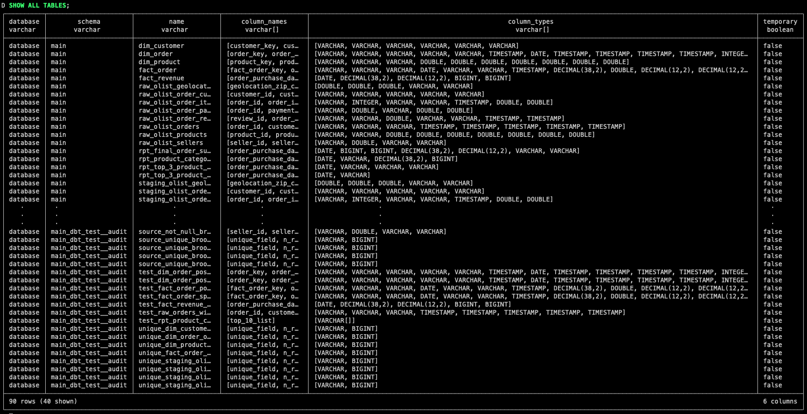
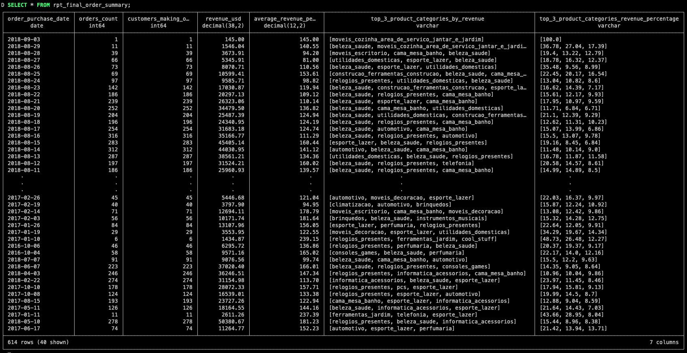

# DuckDB & dbt Local Analysis
This project makes use of duckdb and dbt to run analytics locally.

* [DuckDB](https://duckdb.org/) is a super fast in-memory columnar data store that works great with CSV, JSON, Parquet and remote object stores like S3.  
* [dbt](https://www.getdbt.com/) (data build tool) is a data processing framework for build and testing models and documenting your data.
* [dbt-duckdb adapter](https://github.com/jwills/dbt-duckdb) is the adapter used in this project to facilitate that communication between duckdb and dbt - created by [Josh Wills](https://github.com/jwills)
* The [data](https://app.mode.com/brooklyndata/tables) used in this project is from Brooklyn Data

## Project Structure
```
├── README.md
├── data
├── dbt
├── duckdb
└── requirements.txt
```
* `README.md` is this file which contains some setup and general instructions
* `/data` contains all csv files related to Brooklyn Data
* `/dbt` contains all dbt project files and configs
* `/duckdb` contains the necesary duckdb files and setup information
* `requirements.txt` contains all necessary dependencies to make things work


## dbt Project Structure
The dbt project is set up as follows:
`raw > staging > warehouse > reporting`

* Raw: 1:1 raw selection of data from the source
* Staging: 1:1 select of data from the raw layer - data cleaning and conforming can happen here if necessary
* Warehouse: dimensional/fact modeling as per Kimball/Inmon
* Reporting: aggregations of the previous layers to roll things up to different granularities

## dbt Test Storage
dbt test results are stored in duckdb via configs in `dbt_project.yml`


## CICD - Linting
This project makes use of SQLFluff linting to validate code-consistency.
There is a Github Actions workflow setup to perform CI/CD that will automatically look for changed files in the dbt/models/ directory and automatically run SQLFLuff if necessary.

See: `./github/workflows/ci.yml`

## Setup
**Set up a python virtual environment. From the root:**  
`python -m venv .venv`

**Activate the virtual environment**  
`source .venv/bin/activate`

**Install the dependencies**  
`pip3 install -r requirements.txt`

**Install the duckdb cli and add to your path**  
See: `./duckdb/README.md`

**Delete the existing duckdb database if it exists**  
`rm ./duckdb/database.duckdb`

**Run the dbt project**
This will import all data from CSVs, build the raw, staging, warehouse and reporting layers and run all tests  
`cd dbt`  
`dbt deps`  
`dbt debug`  
`dbt build`

**Query the database**  
From the duckdb directory:  
`cd duckdb`  
`duckdb database.duckdb`  
`SHOW ALL TABLES;`  
`SELECT * FROM rpt_final_order_summary;`  
`.quit`  


## Screenshots
dbt build


duckdb show all tables


duckdb select from rpt_final_order_summary model



## Observations
- There are a number of orders which do not have any line items
    - These should be filtered out
- Do we only want to report on orders that are not in ('unavailable', 'canceled')?
    - Making the assumption that we don't want these

## Improvements:
- Could flesh out the data model more - more dims/facts
- Add even more tests, especially around timestamps
    - did timestamps in two related fields happen in the right order
    - Are they all populated
- Some models could be made incremental IF the data were to get larger - no need to reprocess records from years ago if they haven't changed ($$).
- Add a macro that records the timestamp at which a record is modified by dbt
    - This doesn't really matter in our case since everything is getting re-generated on each run but it does matter when you start getting into incremental models and it helps greatly with troubleshooting.
- Run the outputs through a visualization tool to ensure sanity - does it pass the eyeball test? Rill Developer?
- Split all of the models up into their own schemas - for ease I just kept them in the same schema.
    - Run `SHOW ALL TABLES;` on duckdb
- Add linting so that all of the sql is consistent - SQLFluff
- Create a Makefile so the project is easy to develop on
